# 🛡️ Sentinel — Production-Grade API Gateway

A smart, rate-limited API Gateway built with Spring Boot, featuring JWT authentication, Redis-based sliding window rate limiting, request analytics, and real-time Grafana monitoring.

## 🏗️ Architecture



## ⚙️ Tech Stack

- **Backend**: Java 21, Spring Boot 3.5
- **Security**: JWT (JJWT), Spring Security
- **Rate Limiting**: Redis (Sliding Window Algorithm)
- **Database**: PostgreSQL + Flyway Migrations
- **Monitoring**: Prometheus + Grafana
- **Containerization**: Docker + Docker Compose

## 🔑 Key Features

- JWT authentication with access + refresh token rotation
- Redis sliding window rate limiter (429 after 100 requests/min)
- Request logging to PostgreSQL on every API call
- Analytics API with top endpoints and avg response time
- Real-time Grafana dashboard with JVM, CPU, memory metrics
- Global exception handling with structured error responses

## 📦 API Endpoints

| Method | Endpoint | Description | Auth |
|--------|----------|-------------|------|
| POST | /auth/register | Register new user | No |
| POST | /auth/login | Login and get JWT | No |
| POST | /auth/refresh | Refresh access token | No |
| POST | /auth/revoke | Revoke refresh token | No |
| GET | /analytics/summary | Request stats | Yes |
| GET | /analytics/logs | Recent request logs | Yes |

## 🚀 How to Run

### Prerequisites
- Java 21
- Maven
- Docker Desktop

### Steps

```bash
# Clone the repo
git clone https://github.com/shree9491/Sentinel.git
cd Sentinel

# Start infrastructure
docker-compose up -d

# Create database
docker exec -it gateway_postgres psql -U postgres -c "CREATE DATABASE gateway_db;"

# Run the app
mvn spring-boot:run
```

### Access Points
| Service | URL |
|---------|-----|
| API | http://localhost:8080 |
| Grafana | http://localhost:3000 |
| Prometheus | http://localhost:9090 |

## 🧪 Test Rate Limiting

```powershell
# Login and get token
$login = Invoke-RestMethod -Uri "http://localhost:8080/auth/login" `
  -Method POST -ContentType "application/json" `
  -Body '{"username":"testuser","password":"pass123"}'
$token = $login.accessToken

# Send 110 requests — hits 429 after 100
1..110 | ForEach-Object {
  Invoke-WebRequest -Uri "http://localhost:8080/gateway/test" `
    -Headers @{Authorization="Bearer $token"} `
    -SkipHttpErrorCheck | Select-Object StatusCode
}
```

## 🗄️ Database Schema

- `users` — registered users with hashed passwords
- `refresh_tokens` — token rotation with revocation
- `api_keys` — API key management
- `rate_limit_configs` — per-user rate limit rules
- `request_logs` — every request logged with timing

## 📊 Monitoring

Grafana dashboard showing live:
- JVM heap and non-heap memory
- CPU usage
- HTTP request rates
- Response time percentiles
- Thread count

## 👨‍💻 Author

**Sai Krishna** — [GitHub](https://github.com/shree9491)